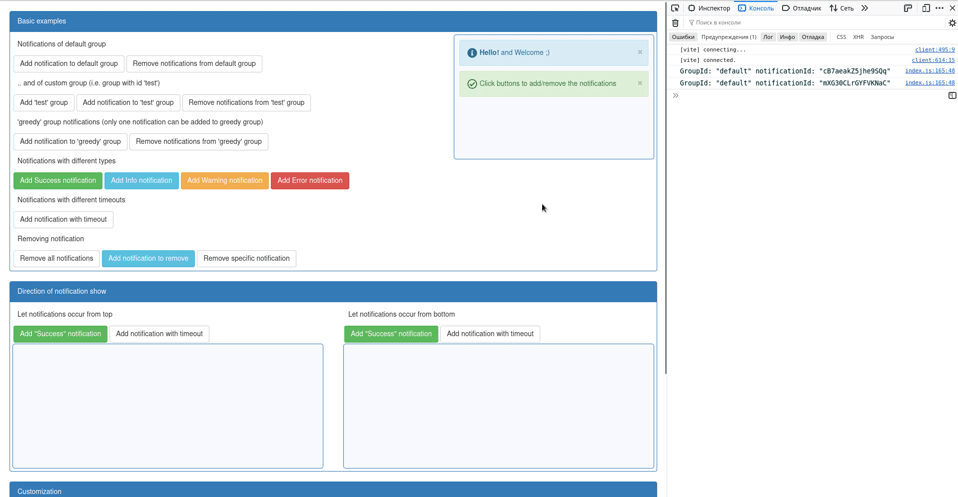

# Notify2 [](https://www.npmjs.com/package/@alekstar79/notify2) [](https://github.com/alekstar79/notify2)

#### TS library for displaying notifications inside specific containers. It is possible to create several independent modules that will have a separate set of notifications.

This project was bootstrapped with [Create Vite](https://github.com/vitejs/vite/tree/main/packages/create-vite#readme)

You can check out the [DEMO](https://alekstar79.github.io/notify2)
<br />
<br />



## <a name="install">Installation</a>

```shell
npm install @alekstar79/notify2
```
or
```shell
yarn add @alekstar79/notify2
```

## <a name="usage">Usage</a>

<ol start="1">
  <li>
Create html element where notifications will be pushed

```html
<div id="notifications"></div>
```

  </li>
  <li>

Specify styles

```css
#notifications {
  min-height: 250px;
  width: 400px;
  padding: 10px;
  background-color: #f7f9ff;
  border-radius: 20px;
  border-color: #a8bbff;
  border-width: 2px;
  border-style: solid;
}
```

  </li>
  <li>

Create new module

```js
let myNotifications = new ToastNotifier({
  container: '#notifications', // required
  onNotificationsCountChange: number => {
    console.log('Number of notifications', number)
  },
})
```

  </li>
  <li>

Create group (optional)

Groups used to operate with the subset of notifications. Group may have one or more elements. You can force the group to have only one element making field `greedy` equal to `true`. It is not necessary to create group, all notifications without specifying `groupId` will be associated with group with id `default`.

```js
myNotifications.createEmptyGroup({
  id: 'test', // required
  greedy: false,
})
```

  </li>
  <li>

Add notifications

```js
// pushNotification - appends new notification (is added from the bottom)
let myNotification1 = myNotifications.pushNotification({
  title: 'Hello!',
  message: "I'm a notification",
  animation: 'fade',  // 'fade' (by default), 'rotate'
  closeInMS: 5000,    // Notification will be closed automatically in specified amount of milliseconds; to prevent notification from closing, just omit this option. It does not close automatically by default.
  groupId: 'test',    // 'default' (by default)
  type: 'info',       // "info" (by default), "warning", "error", "success"
  template: ({ title, message }) => `<p>${title}</p>`, // Allows to create customized notifications. If used, type will be ignored.
})

// unshiftNotification - prepends new notification (is added from the top)
let myNotification2 = myNotifications.unshiftNotification({
  // same options as pushNotification
})
```

  </li>
  <li>

Remove notification

```js
myNotification1.remove()
```

  </li>
  <li>

Remove all the notifications of the specified group

```js
myNotifications.removeNotifications('test')
```

  </li>
  <li>

Remove all the notifications of the module

```js
myNotifications.removeNotifications()
```

  </li>
</ol>

## <a name="customization">Customization</a>

To add customized notidfications you have to:

<ol start="1">
  <li>

Specify function which will return custom template, e.g.

```js
const customTemplate = ({ title, message }) => {
  return `
    <div class='custom-notification'>
      <span>${title}</span>
      <span>${message}</span>
      <span class='mn-close-btn custom-close-btn'>[x]</span>
    </div>
  `
}
```

In order to make custom notification closable by user click assign class `.mn-close-btn` to the element which will trigger closing on click, e.g.

```html
<span class="mn-close-btn">[x]</span>
```

  </li>
  <li>

And assign this function to `template` option:

```js
customizedNotifsModule.pushNotification({
  title: 'Hello!',
  message: "I'm a custom notification",
  template: customTemplate,
})
```

  </li>
</ol>
